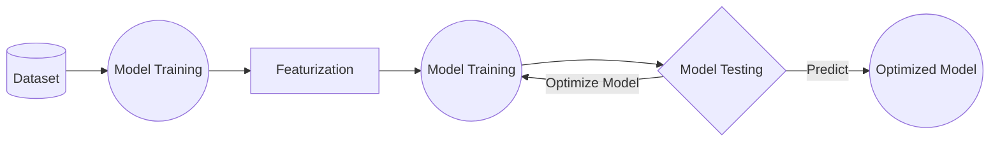
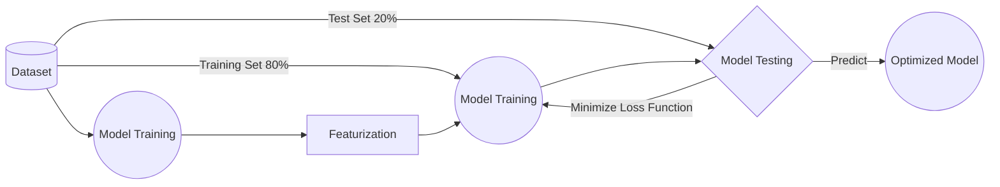

# ML concepts

## What is Machine Learning ?

### Definition 

*It is an ability of computer to learn Logic without explicitly bring programmed*

## Terminology 
- Features : Represented by x in dataset or a piece of data 
- Labels : Target y value trying to predict
- Instance : One sample or row in a dataset

## Flow Chart

# Supervised Learning

## What is Supervised Learning ?

### Definition 

*Algorithm is trained on instances that has been labeled for a particular output so that it can detect the underlying patterns and relationships between the input data and the output labels.When tested on never-before-seen data it should be able to reproduce the same results.*

## Points to Remember
- Label is an outcome all instances should have a label
- Goal is predict outcomes on unseen dataset
- If the label is categorical then it is a **Classification Problem**
- If the label is numerical it is a **Regression Problem.**

## Flow Chart

