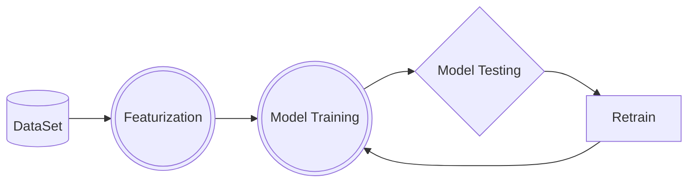

# ML concepts

## What is Machine Learning ?

### Definition 

*It is an ability of computer to learn Logic without explicitly bring programmed*

## Terminology 
- Features : Represented by x in dataset or a piece of data 
- Labels : Target y value trying to predict
- Instance : One sample or row in a dataset

